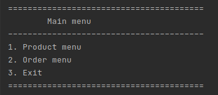
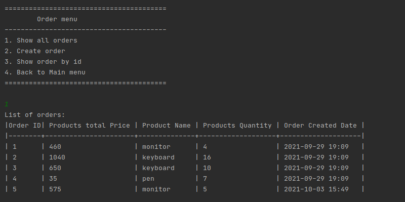

CiklumHybrisTestTask

The application provides such operations:
Creating a product, creating an order with a list of products specified by ID, etc.
Showing different views(ordered goods with a total quantity, goods, etc.).
Meets the requirements of the terms of reference

Start up Application via Maven:
mvn clean install
mvn spring-boot:run

Or just run start file (start.sh, start.bat)

Scripts for database: new script.sql, filling.sql

First you will see the Main menu from which you can go to the menu of orders and products
or shut down the application. After performing the operation in each menu by default,
you will remain in the same menu, enter the corresponding number to exit

Example of interaction

